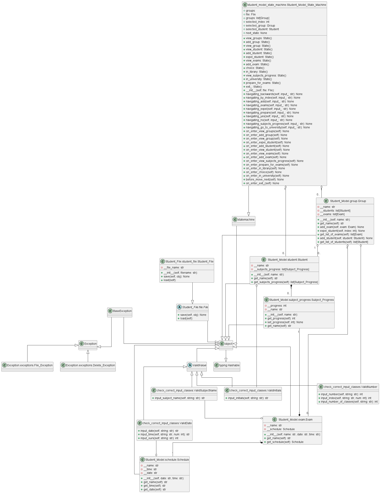
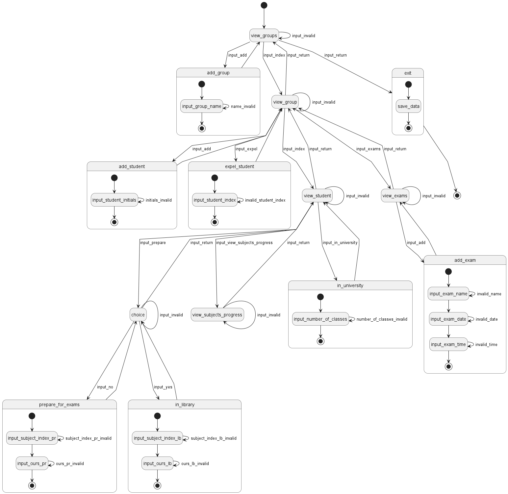

# Лабораторная работа №1

## Цель: 
1. Изучить основные возможности языка Python для разработки программных систем с интерфейсом командной строки (CLI).
2. Получить навыки построения диаграмм состояния и классов.
3. Разработать программную систему на языке Python согласно описанию предметной области.
4. Рализовать сохранение состояния системы
## Задача:
Разработать программную систему на языке Python. 
Модель: Студент

<em>
Предметная область: обучение и активности студента.  
Важные сущности: студент, учебные материалы, расписание, группа, экзамены, библиотека. 
Операции: операция посещения занятий, операция изучения материалов, операция подготовки к экзаменам, операция учебного планирования, операция использования библиотечных ресурсов.
</em>

## Сущности:
Для реализации данной модели были реализованы следующие сущности:

Exam, Group, Schedule, Student, Subject_Progress.

## Диаграмма классов:
По условию варианта была составлена диаграмма классов:

## Диаграмма состояний:
Исходя из состояний системы была создана диаграмма:

## Работа программы:
Программа предлагает консольный интерфейс для работы с системой: добавление группы, добавление/отчисление студента, добавление экзамена, изучение материалов, поход в университет, а также консольный вывод всех состояний системы.

## Вывод:
В ходе выполнения работы я изучил принципы построения диаграмм состояний и классов, которые помогают спроектировать абстрактную часть системы, не ссылаясь на конкретную её реализацию. Были усвоены основные типы данных языка Python, а также его основные конструкции, такие как циклы, условные операторы, включение модулей, операции ввода, вывода, и создание, и вызов функций. Кроме того разобрал принцип создания классов в python. С помощью всего этого была создана программа, реализующая модель студента.
