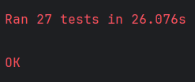
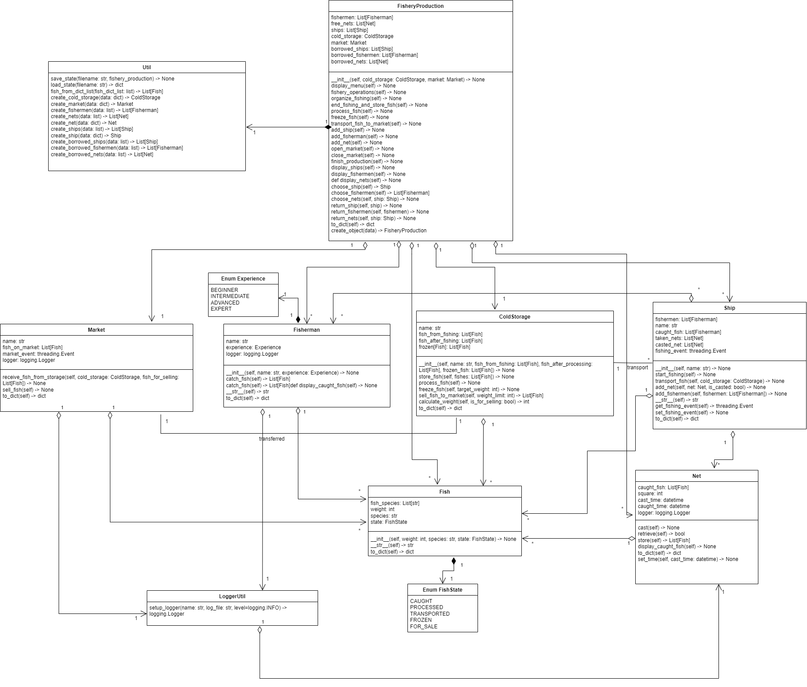
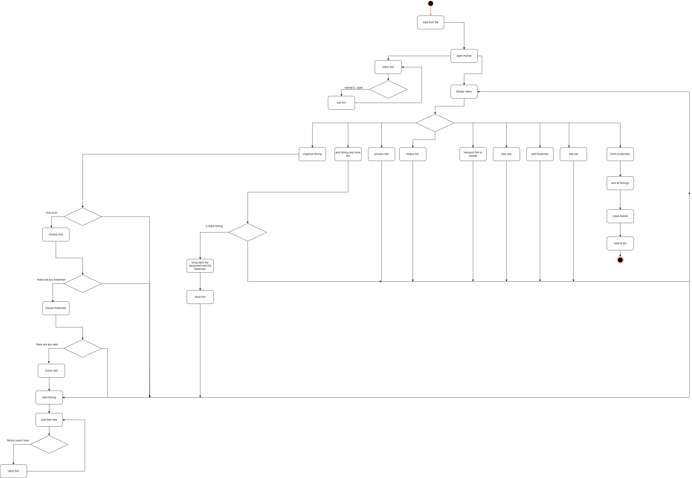

## Лабораторная работа №1

### Вариант: 19

### Цель: 
- Изучить основные возможности языка Python для разработки программных систем с интерфейсом командной строки (CLI)
- Разработать программную систему на языке Python согласно описанию предметной области
### Задача: Модель рыболовного произвоодства
- Предметная область: процесс вылова и переработки рыбы на рыбопромыслах.
- Важные сущности: рыболовное производство, рыбак, рыба, судно, сеть, хладокомбинат, рынок рыбной продукции
- Операции: операция вылова рыбы, операция хранения и транспортировки, операция переработки рыбы, операция управления производством, операция продажи рыбной продукции.

### Тестирование:

### Сущности и основныые операции:
#### Ship:
- start_fishing(self) -> None
    - Начинает операцию вылова рыбы.
- transport_fish(self, cold_storage: ColdStorage) -> None
    - Осуществляет транспортировку рыбы в хладокомбинат

#### Fisherman:
- catch_fish(self) -> List[Fish]
    - Позволяет рыбаку ловить рыбу
#### Net:
- cast(self) -> None 
    - Осуществляет бросок сети
- retrieve(self) -> bool
    - Производится подъем сети(если прошло определенное время)
- store(self) -> List[Fish]
    - Извлечение рыбы из сети
#### Market:
- receive_fish_from_storage(self, cold_storage: ColdStorage, fish_for_selling: List[Fish]) -> None
    - Получает рыбу из хранилища
- sell_fish(self) -> None
    - Продажа рыбы
#### ColdStorage:
- store_fish(self, fishes: List[Fish]) -> None
    - Осуществляет складирование рыбы
- process_fish(self) -> None
    - Осуществляет обработку рыбы
- freeze_fish(self, target_weight: int) -> None
    - Осуществляет заморозку рыбы
- sell_fish_to_market(self, weight_limit: int) -> List[Fish]
    - Осуществляет передачу рыбы на рынок
#### Fish:
- __init__(self, weight: int, species: str, state: FishState) -> None
    - Осуществляет создание рыбы
#### FisheryProduction
- fishery_operations(self) -> None
    - Производит выбор операции
- organize_fishing(self) -> None
    - Создает рыбалку
- end_fishing_and_store_fish(self) -> None
    - Заканчивает рыбалку
- process_fish(self) -> None
    - Осуществляет обработку рыбы
- freeze_fish(self) -> None
    - Осуществляет заморозку рыбы
- transport_fish_to_market(self) -> None
    - Осуществляет транспортировку обработанной рыбы на рынок
- add_ship(self) -> None
    - Осуществляет добавление корабля на производство
- add_fisherman(self) -> None
    - Осуществляет добавление рыбака на производство
- add_net(self) -> None
    - Осуществляет добавление сети на производство
- open_market(self) -> None
    - Осуществляет открытие рынка

### Тестирование:

### Диаграммы:

#### Диаграмма классов:

#### Диаграмма состояний

### Вывод:
В ходе выполнения лабораторной работы была разработана модель рыболовного производства на языке программирования Python.
Для написания был выучен базовый синтаксис языка , а также базовые конструкции по многопоточности в нем.
После создания модели были реализованы диаграммы классов и состояний, которые отражают разработанную структуру программы.