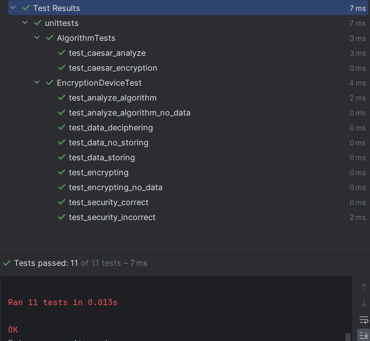

# Лабораторная работа №2 
## По курсу "Проектирование программного обеспечения интеллектуальных систем"(часть 2)

### Цель:
- Изучить основные возможности языка Python для разработки программных систем с интерфейсом командной строки (CLI)
- Разработать программную систему на языке Python согласно описанию предметной области

### Задание:
● провести объектно-ориентированный анализ предметной области, которая
описана в варианте задания
● разработать программную систему на языке Python в соответствии с
требованиями варианта задания и общими требованиями

###Tребования:
● при написании кода использовать стандарт PEP8 и аннотацию типов
● использовать механизм исключений для обработки ошибочных ситуаций
● программная система должна быть разработана с интерфейсом командной
строки (CLI)
● задокументировать реализацию программной системы при помощи языка
разметки markdown
● разработать unit-тесты
● исходники программы и документация должны быть размещены на github

### Вариант 62: Модель шифровального устройства

**Предметная область:**  шифрование и дешифрование информации.

**Важные сущности:** шифровальное устройство, ключ, алгоритм, зашифрованные данные, открытый текст.

**Операции:** операция шифрования данных, операция дешифрования информации, 
операция управления ключами, операция обеспечения безопасности, 
операция анализа криптографической стойкости.

### Реализация программы:

Я реализовал все необходимые сущности и операции в соответствии с условиями и требованиями лабораторной работы;

Сущности:
- EncryptionDevice - шифровальное устройство
- Algorythm - алгоритм 
- Data - открытый текст
- EncryptedData -  зашифрованные данные
- KeyClass - ключ

Операции:
Все операции были реализованны в представлении класса EncryptionDevice

- security(self) - операция обеспечения безопасности
- analyze_algorythm(self) - операция анализа криптографической стойкости
- decipher_data(self) - операция дешифрования информации
- encrypt_data(self) - операция шифрования данных
- manage_key(self) - операция управления ключами (представляется в классе Algorythm)

А также несколько вспомогательных операций для ввода/вывода

### Unit tests 

Для проверки корректной работы программы добавлены unit тесты:

### Вывод:

В результате выполнения этой лабораторной работы я научился применять ооп на языке Python, изучил основный конструкции и структуры этого языка, а также повторил основные правила написания качественного кода (solid, а также стандарт pep8). В результате мной была создана модель шифровальной машины, которая принимает текст на английском языке и используя шифр Цезаря преобразует информацию по заданному ключу, также есть возможности анализа и обратного кодирования информации.
