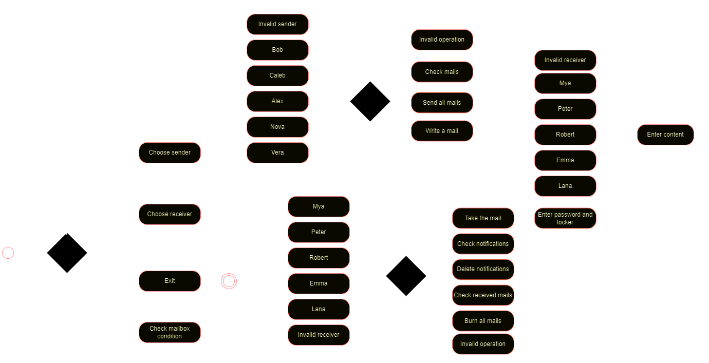
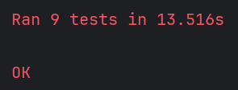

# Лабораторная работа №1

## Цель: 
1. Изучить основные возможности языка Python для разработки программных систем с (CLI)
2. Разработать программную систему на языке Python согласно описанию предметной области

## Задача:
Разработать программную систему на языке Python. Модель почтомата

Предметная область: автоматизированные пункты выдачи и приема почтовых отправлений.
Важные сущности: почтомат, почтовые отправления, получатель, отправитель, уведомление.
Операции: операция отправки почтовых отправлений, операция получения посылок из почтомата, операция уведомления получателя, операция технического обслуживания почтомата, операция обеспечения безопасности.

## Сущности:
Отправитель - Sender  
Получатель - Receiver  
Почтомат - Mailbox  
Уведомление - Notification  
Почтовое отправление - Mail  

## Диаграмма состояний:
Исходя из состояний системы была создана диаграмма:

## Работа программы:
Программа предлагает консольный интерфейс для работы с системой:  
Для отправителя: написание, проверка, отправка писем;  
Для получателя: проверка уведомлений, удаление уведомлений, получение письма (с вводом пароля, указанного в уведомлении), прочтение полученных писем, сжигание (удаление) писем;  
Для почтомата: функция проверки состояния почтомата.  

## Тестирование:
Были протестированы все классы данной системы и по результатом тестирования можно сказать, что классы работают корректно

## Вывод:
В ходе выполнения работы я изучил принципы построения диаграмм состояний и классов, 
которые помогают спроектировать абстрактную часть системы, не ссылаясь на конкретную её реализацию. 
Были усвоены основные типы данных языка Python, а также его основные конструкции, такие как циклы, условные операторы, 
включение модулей, операции ввода, вывода, и создание, и вызов функций. Кроме того разобрал принцип создания классов в python.
С помощью всего этого была создана программа, реализующая модель почтомата.