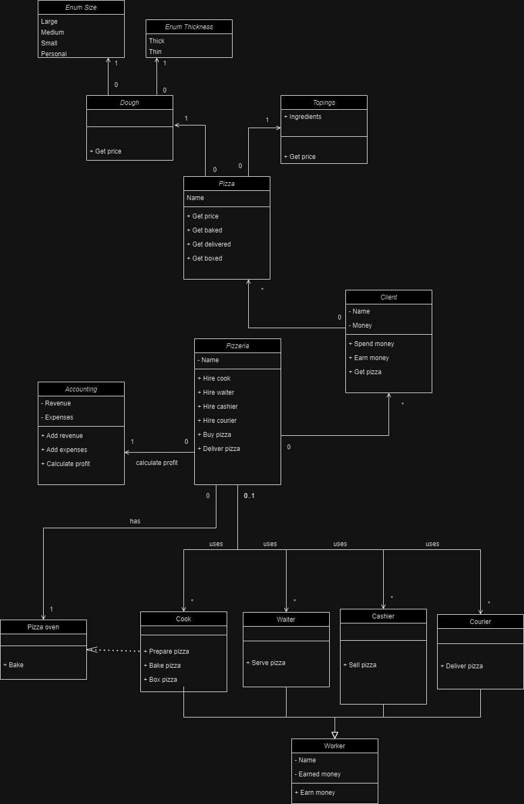
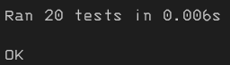

# Лабораторная работа №1

## Цель: 
1. Изучить основные возможности языка Python для разработки программных систем с интерфейсом командной строки (CLI).
2. Получить навыки построения диаграмм состояния и классов.
3. Разработать программную систему на языке Python согласно описанию предметной области.
4. Рализовать сохранение состояния системы
## Задача:
Разработать программную систему на языке Python. 
Модель: Пицерия

<em>
Предметная область: приготовление и продажа пиццы.  
Важные сущности: пиццерия, повар, заказчик, тесто, начинки, печь, курьер. 
Операции: операция приготовления пиццы, операция принятия заказов, операция доставки, операция обслуживания посетителей, операция бухгалтерии.
</em>

## Сущности:
Для реализации данной модели были реализованы следующие сущности:

Client, Dough, Topings, Pizza, Accounting, Pizzeria, PizzaOven

А также для реализации всех сущностей связанных с профессиями была создана сущность Worker 
От неё наследуются сущности: Courier, Waiter, Cashier, Cook

## Диаграмма классов:
По условию варианта была составлена диаграмма классов:

## Диаграмма состояний:
Исходя из состояний системы была создана диаграмма:

## Работа программы:
Программа предлагает консольный интерфейс для работы с системой: добавление посетителей/заказчиков и рабочих пицерии, заказ пицы и покупка пиццы как на вынос, как и внутри, вывод информации о системе(пицерия и клиенты), возможность сброса состояния системы

## Тестирование:
Были протестированы все классы данной системы и по результатом тестирования можно сказать, что классы работают корректно

## Вывод:
В ходе выполнения работы я изучил принципы построения диаграмм состояний и классов, которые помогают спроектировать абстрактную часть системы, не ссылаясь на конкретную её реализацию. Были усвоены основные типы данных языка Python, а также его основные конструкции, такие как циклы, условные операторы, включение модулей, операции ввода, вывода, и создание, и вызов функций. Кроме того разобрал принцип создания классов в python. С помощью всего этого была создана программа, реализующая модель пицерии