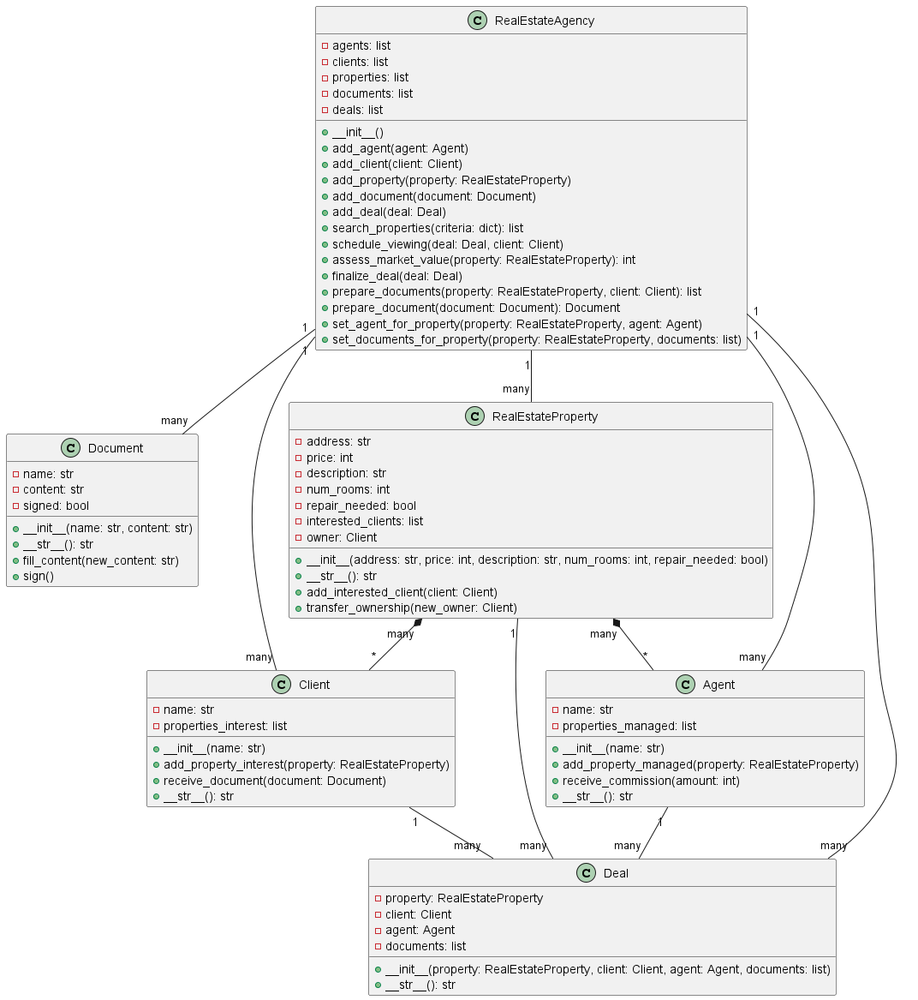

## Модель Агенства по Недвижимости

### Описание

#### Цель:  

- Изучить основные возможности языка Python для разработки программных систем с интерфейсом командной строки (CLI) 
- Разработать программную систему на языке Python согласно описанию предметной области

#### Задачи: 

- Разработать программную систему по предметной области: посредничество в сделках с недвижимостью.
- Реализовать операции:
   1. Операция поиска объектов недвижимости 
   2. Операция проведения просмотров 
   3. Операция оценки рыночной стоимости 
   4. Операция оформления документации 
   5. Операция заключения сделки.


- Реализовать ключевые сущности:
    1. агенство по недвижимости
    2. агент
    3. клиент
    4. объект недвижимости
    5. документы
    6. рынок недвижимости


### Релизация

 - ##### Агент

Имеет такие свойства как:

- ФИО
- Объекты, управляемые агентом


##### Фрагмент кода:
```python
class Agent:
    def __init__(self, name):
        self.name = name
        self.properties_managed = []

    def add_property_managed(self, property):
        self.properties_managed.append(property)

    def receive_commission(self, amount):
        print(f"Агент {self.name} получил сумму за объект в размере {amount}.")

    def __str__(self):
        return self.name
```

- ##### Клиент

Клиент так же имеет такие свойства, как:

 - ФИО
 - Интересующие его объекты 

##### Фрагмент кода:
```python
class Client:
    def __init__(self, name):
        self.name = name
        self.properties_interest = []
        
    def add_property_interest(self, property):
        self.properties_interest.append(property)

    def receive_document(self, document):
        print(f"Документ {document} получен клиентом {self.name}.")

    def __str__(self):
        return self.name
```

- ##### Документ

Класс документ состоит из таких полей, как:

Свойства класса Document:

 - название документа 
 - содержимое документа 

##### Фрагмент кода:
```python
class Document:
    def __init__(self, name, content):
        self.name = name
        self.content = content
        self.signed = False  

    def __str__(self):
        return self.name

    def fill_content(self, new_content):
        self.content = new_content

    def sign(self):
        self.signed = True

```

- ##### Агенство по недвижимости

Агенство по недвижимости включает в себя следующие поля:

 - список агентов
 - список клиентов
 - список характеристик
 - список документов 
 - список сделок

##### Фрагмент кода:
```python
class RealEstateAgency:
    def __init__(self):
        self.agents = []
        self.clients = []
        self.properties = []
        self.documents = []
        self.deals = []
```

В классе Агенство по недвижимости осуществляется реализация основной логики системы.
Агенство по недвижимости реализует следующие операции:

__Добавление агента, клиента, объекта недвижимости, документа, сделки в соответствующие им списки:__
```python

    def add_agent(self, agent):
        self.agents.append(agent)

    def add_client(self, client):
        self.clients.append(client)

    def add_property(self, property):
        self.properties.append(property)

    def add_document(self, document):
        self.documents.append(document)

    def add_deal(self, deal):
        self.deals.append(deal)
```
__Поиск объекта по критериям:__

```python
  def search_properties(self, criteria):
        matching_properties = []
        for property in self.properties:
            is_match = True
            for key, value in criteria.items():
                if getattr(property, key) != value:
                    is_match = False
                    break
            if is_match:
                matching_properties.append(property)
        return matching_properties

```
__Просмотр объекта__
```python
    def schedule_viewing(self, deal, client):
        property = deal.property
        property.add_interested_client(client)
        print(f"Клиент {client} запросил просмотр объекта недвижимости {property}. Уведомление агенту {deal.agent}.")

```
__Оценочная рыночная стоимость__
```python
    def assess_market_value(self, property):
        price_per_room = 50000
        repair_factor = 1.0
        if property.repair_needed:
            repair_factor = 0.8
        market_value = price_per_room * property.num_rooms * repair_factor
        return market_value

```
__Заполнение документов__
```python
 def prepare_document(self, document):
        # Подготавливаем документ (например, заполняем его содержимое)
        prepared_document = Document(document.name, "Заполнение содержимого")  
        prepared_document.sign() 
        return prepared_document
   

```
__Подписание документов__
```python
    def prepare_documents(self):
        documents = [Document("Договор купли-продажи", "..."), Document("Право собственности", "...")]
        return documents

```
__Заключение сделки__
```python
        def finalize_deal(self, deal):
        self.deals.append(deal)
        print(f"Сделка {deal} успешно заключена! Уведомление агенту {deal.agent} и клиенту {deal.client}.")

        for document in deal.documents:
            prepared_document = self.prepare_document(document)
            deal.client.receive_document(prepared_document)

        deal.property.transfer_ownership(deal.client)
        deal.agent.receive_commission(deal.property.price)

```
- ##### Передача имущества клиенту
```python
     class RealEstateProperty:
    def __init__(self, address):
        self.address = address
        self.interested_clients = []
        self.owner = None

    def __str__(self):
        return self.address

    def add_interested_client(self, client):
        self.interested_clients.append(client)

    def transfer_ownership(self, new_owner):
        self.owner = new_owner
        print(f"Собственность на объекте недвижимости {self.address} передана новому владельцу {new_owner}.")


```


### Диаграмма классов



### Диаграмма состояний

