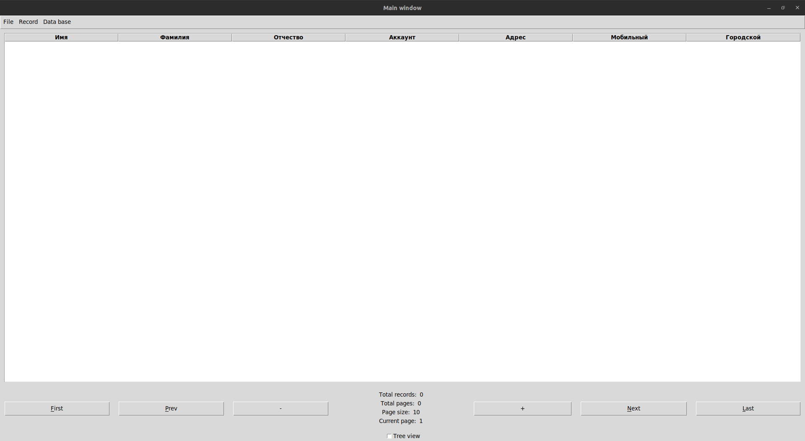
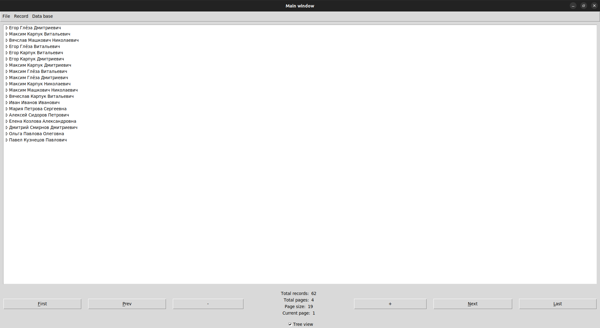
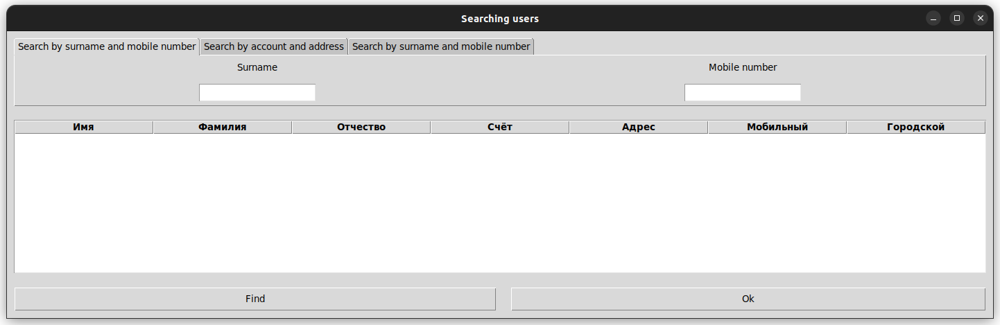
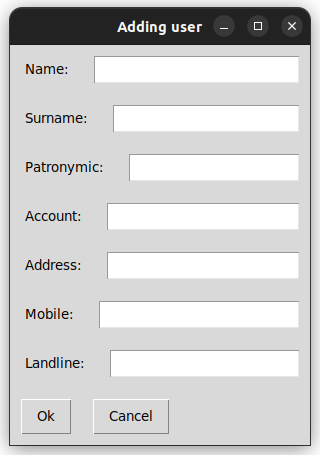

# Лабораторная работа 2

### Главное окно приложения

Главное окно включает в себя основную область, состоящую таблицы для просмотра пользователей, а также меню со всеми командами.

Навигация по таблицам осуществляется постранично. Возможно выбрать, сколько записей отображается на странице, а также отображается число доступных для просмотра страниц.

Галочкой Tree view можно включить отображение записей в виде древовидной структуры.

### Источники данных

Для работы с приложением необходимо открыть файл базы данных, где будут храниться записи о пользователях.

Хранение возможно в:
- .sqlite файлах
- XML файлах.

Для открытие подключения к базе данных необходимо нажать кнопку Data base -> Open.

Для работы с XML файлами необходимо перед этим открыть БД. Затем можно сохранить записи на странице с помощью File -> Save to XML, либо открыть существующий файл с помощью File -> Load from XML.

Сохранение изменений в БД происходмт с помощью Data base -> Commit.

### Окно поиска

При наличии БД возможно осуществить поиск  записей. Для этого необходимо нажать кнопку Record -> Search.

В диалоговом окне будет предложено включить определенные критерии поиска, а также указать ограничения.

Возможен поиск по:
- Фамили и мобильному номеру
- Счёту и адресу
- ФИО и цифрами из номеров

После применения фильтра поиска найденые записи будут добавлены на окно поиска.

### Окно удаления

Логика работы окна удаления аналогична окну поиска. Критерии удаления совпадают с критериями поиска. Отличие заключается то, что после нажатия ОК будет предложено удалить записи.

### Добавление студента

Для добавления пользователя необходимо открыть БД, после чего нажать кнопку Record -> Add. Будет предложено ФИО, счёт, адрес, номера телефона.
