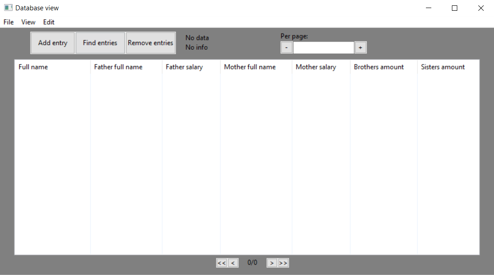
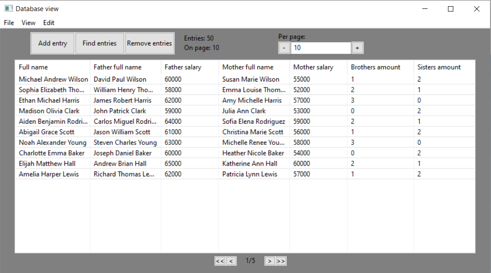
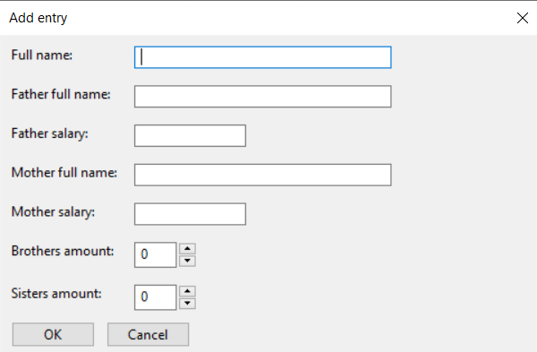
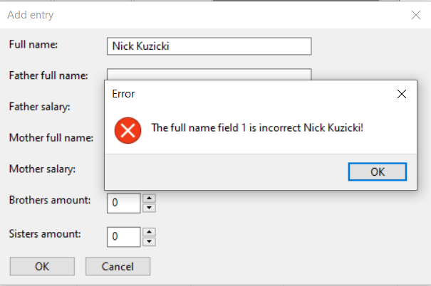
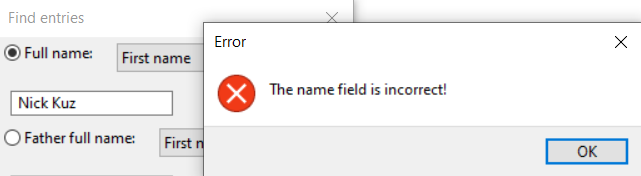
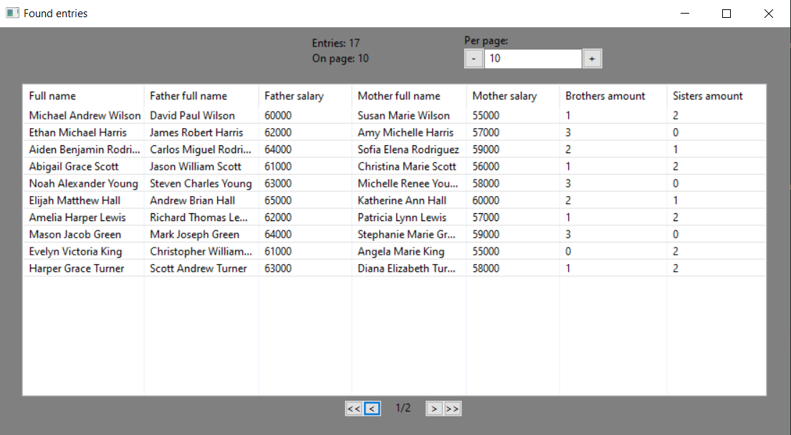
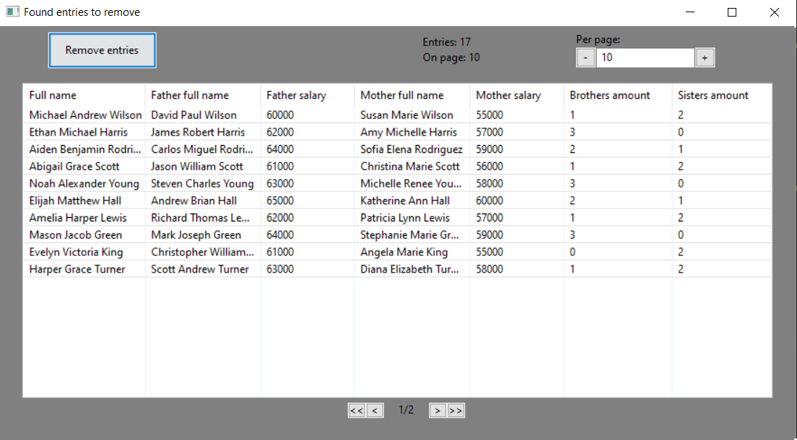
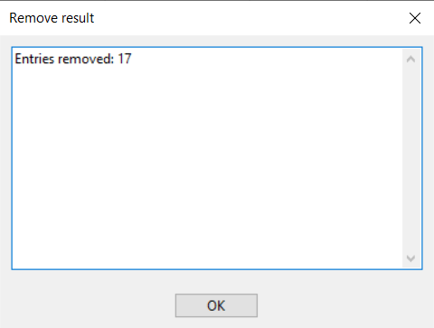
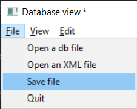
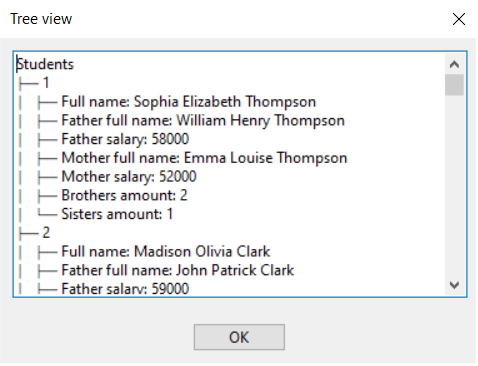

# Лабораторная работа №2

## Цель: 
1. Изучить принципы построения графического пользовательского интерфейса
2. Разработать программную систему с графическим пользовательским интерфейсом на языке Python

## Задача:
Разработать оконное приложение с одним главным окном и несколькими дочерними диалогами. Вызов диалогов осуществляется через соответствующие пункты меню. Команды меню должны дублироваться на панели инструментов.  
Вариант 10

<em>
Массив формируется со следующими полями: 
ФИО студента, ФИО отца, заработок отца, ФИО матери, заработок матери, число братьев, число сестёр.
</em>

Условия поиска и удаления следующие:
* по ФИО студента (Может быть заполнен только один элемент ФИО, например имя);
* по ФИО одного из родителей. (Может быть заполнен только один элемент ФИО, например имя);
* по числу братьев или сестер;
* по размеру заработка одного из родителей (Задается нижняя или верхняя граница, или обе)

## Работа программы:
При запуске программы она выглядит следующим образом:

Для того, чтобы начать работу необходимо выбрать один из форматов файла: db(Open a db file) или xml(Open an xml file)  в панели инструментов File:

Кроме этого есть возможность сохранения изменений и выхода из программы.

После выбора файла появляется возможность перемещатся по страницам и просматривать массив записей.

Кроме этого у нас появляется возможность воспользоваться функциями на панели интсрументов View(Tree, Find) и Edit(Add, Remove), а на самом меню: Add entry, Find entries, Remove entries. А также можно изменять количество записей на одной странице с помощью изменения числа в поле Per page. На окне поялвяется дополнительная информация о количестве всех страниц, на какой мы находимся, сколько всего записей и сколько записей выводится в данный момент.

## Добавление записей

Для добавления записей можно нажать опцию Edit->Add или же кнопку Add entry на главном меню. После этого у нас всплывает окно, в которое необходимо ввести определенные данные:

При не соответствии типа данных или условий для заполенения конкретного поля появляется ошибка, предупреждающая пользователя об этом:

## Нахождение записей

Для того, чтобы найти все записи соответствующие определенному условию нужно воспользоваться опцией View->Find или же кнопкой Find entries. После этого появится следующий диалог, в котором можно выбрать определенное условия для поиска:

Здесь также отлавливаются ошибки при заполнении условий:

После заполнения условия появляются все записи удовлетворяющие ему и их можно просматривать также, как и на главном окне:

## Удаление записей

Принцип абсолютно схож с функцией нахождения записей, но с одним исключением, что на окне появляется кнопка Remove entries:

После её нажатия высвечивается, сколько записей было удалено в процессе выполнения операции:

## Сохранение записей

После выполнения операций добавления или удаления записей необходимо их сохранить, чтобы изменения остались такими же, как и прошлом изменении массива записей. Узнать о том, что массив записей был изменен, можно с помощью символа * после названия программы:

Чтобы изменения вступили в силу нужно нажать кнопку File->Save file:

После этого символ * пропадёт и наши изменения успешно сохранятся:

## Отображение в виде дерева

Чтобы представить массив записей в виде дерева достаточно нажать View->Tree и появится отдельное окно с представлением:

## Вывод:
В результате выполнения лабораторной работы я изучил основы работы с базами данных, представление и парсинг xml файлов(dom и sax). А также освоил шаблон MVC, который предназначен для распределения обязанностей в программе и соответсвующей абстракции приложения, которое помогает проектировать и разрабатывать комлексные программы и их в конечном счёте поддерживать в дальнейшем без дополнительных затрат. Были закреплены принципы построения приложений в целом и изучены их принципы реализации на языке программирования Python. Благодаря этим знаниям было разработано приложение с графическим инерфейсом, которое облегчает работу с базой данных конечному пользователю.
