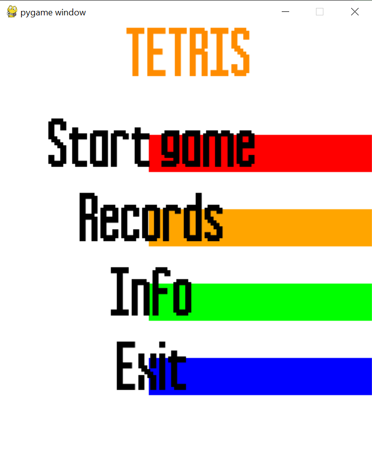
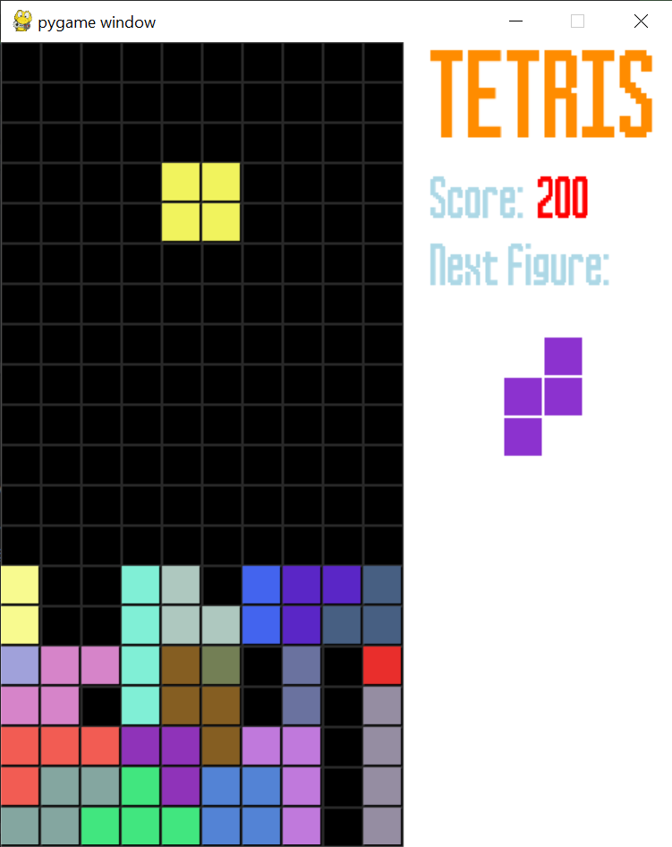
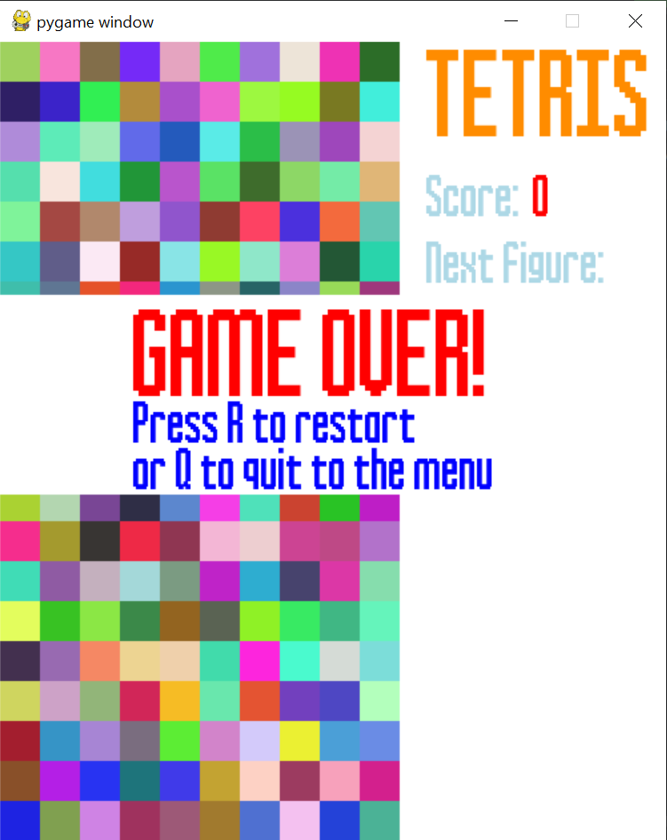
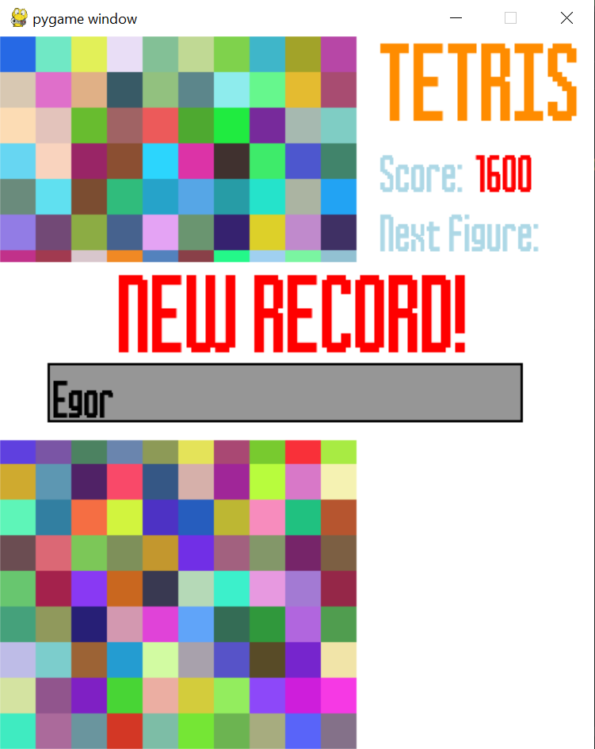
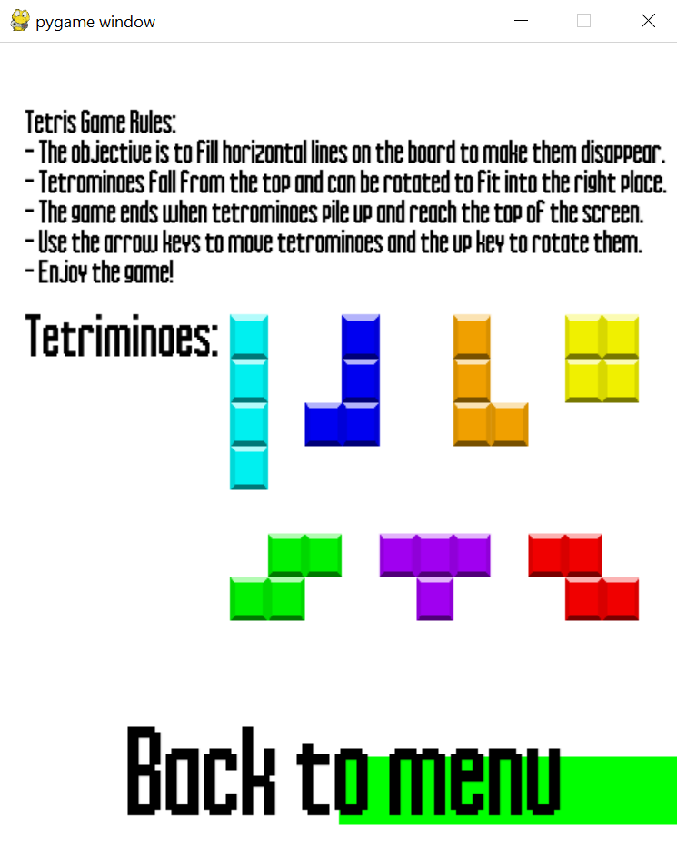

## Лабораторная работа №3

### Вариант: 12 (Tetris)

### Цель:
- Изучить событийно-ориентированное программирование с использованием библиотеки на языке Python (рекомендуется библиотека pygame)
### Задача: 
Разработать игровое графическое приложение согласно выбранному варианту. При разработке игры необходимо изучить функциональность оригинальной игры и по умолчанию реализовывать правила оригинальной игры

### Демонстрация разработанной игры:
### Меню:
В главном меню игры нас встречают команды: “Start game”, “Records”, “Info”, “Exit”

### Start game:
- Сама игра отображает игровое поле, расположенное в левой части экрана, а так же текущий счёт и следуюущую фигуру, которая будет выбрана, после падения текущей фигуры.
  
- При поражении запускается анимация заполнения всего поля разноцветными квадратами, а после пользователю даётся выбор, продолжить игру дальше или выйти в меню.
  
- При достижении нового рекорда пользователь вводит имя, которое будет записано в таблицу рекордов.

### Records:
Здесь в виде списка показывается таблица рекордов, в порядке убывания (от большего к меньшему).

### Info:
Здесь кратко отображаются правила игры и типы геометрических фигур, которые могут появится в ходе игры

### Дополнительные требования:
- В игре присутствуют звуки удаления линии (при сложении целого ряда) тетримино, звук поражения, когда фигура касается крайней верхней части игрового поля и фоновая музыка.
- Присутсвует анимация заполнения игрового поля разноцветными квадратами при поражении
- Рекорды сохраняются в файл records.json
- Характеристики фигур (их координаты) берутся из файла с форматом json (figures_conf.json) 
- Реализованы повороты геометрических фигур
- Реализовано 6 типов геометрических фигур

### Вывод:
При написании данной лабораторной работы я ознакомился с библиотекой pygame для создания игр. Библиотека позволяет программистам быстро писать небольшие проекты, при этом обеспечивая их всеми необходимами элементами для создания полноценных игр. 