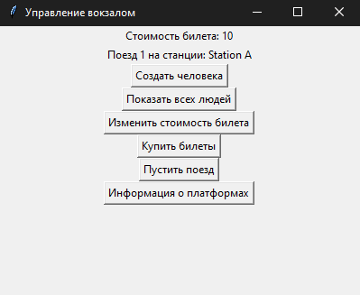
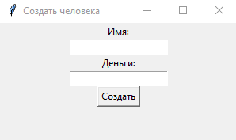
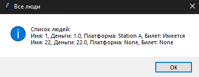
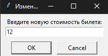
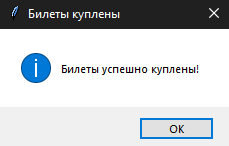
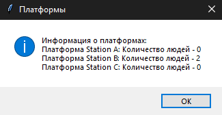

# Лабораторная работа №2

## Цель: 
1. Изучить архитектурные приемы построения пользовательского интерфейса

## Задача:
За основу берется результат лабораторной работы №1. Необходимо разработать графический пользовательский интерфейс к программной системе, которая получилась в л/р №1.

## Работа программы:
При запуске программы она выглядит следующим образом:

## Создание человека
Для создания нового человека нажимаем на "Создать человека"

После ввода данных нажимаем "Создать"

## Список всех людей
Для получения списка людей нажинаем на "Показать всех людей", после чего у нас откроется дополнительное окно со всеми людьми и информацией о них.

## Изменение стоимости билета
После нажатия на "Изменить стоимость билета", появится окно, в котором можно указать новую стоимость

## Покупка билетов
После нажатия на "Купить билеты", будет попытка преобрести билеты для каждого человека, если у него не хватает денег, билет куплен не будет

## Передвижение поездов
Нажатие на "Пустить поезд" передвигает поезд на следующую станцию, при этом загружая и выгружая людей

## Получение информации о платформах

При нажатии на "Информация о платформах" появляется окно со всеми станциями и количеством людей на них

## Вывод:
В данной работе было создано графическое приложение с использованием библиотеки Tkinter для управления вокзалом. Приложение позволяет выполнять различные операции, такие как просмотр информации о людях на станциях, добавление новых людей на станцию, перемещение поезда, изменение стоимости билета и т. д.
